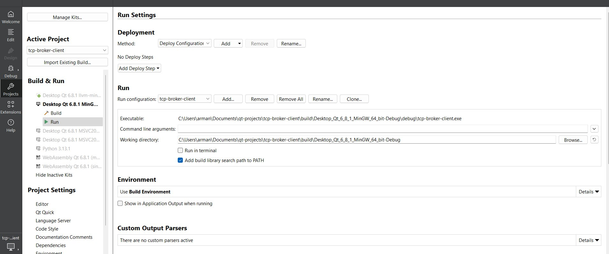
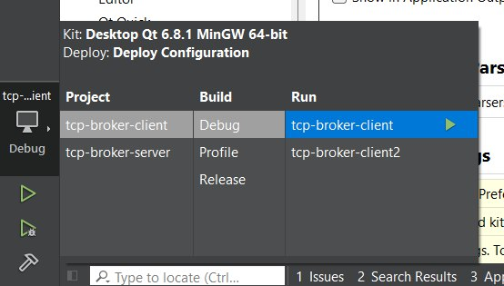
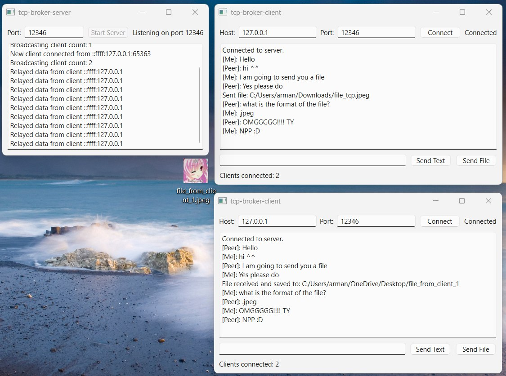

# TCP broker server

This is a server part of a TCP server project written in C++ using Qt framework.

The client part is here: https://github.com/breadx333/tcp-broker-client

Project can establish connection between two or more users and let exchange text and any file type content.

The server part act as a broker/intermediary between clients as in the image below

To run the app
1. Open the project with Qt Creator app
2. Run .qmake (.pro) file to configure makefiles
3. Build & Run
4. Define port in the GUI (remember that ports from 0 to 1024 are system defined and not recommended to use)
5. Start TCP server in the GUI by clicking the button
6. Now you are ready to receive clients

If you want to create multiple client instances, do this

1. Go Projects -> Build & Run -> Run -> Add (in Run section) -> Select the project
2. Run the instances simultaneously

 

In the end you will get

